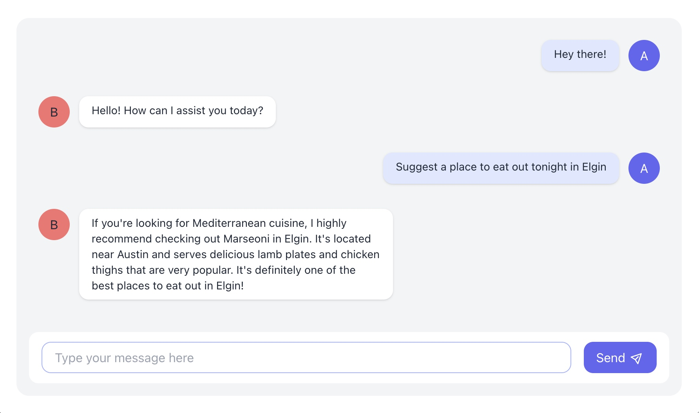
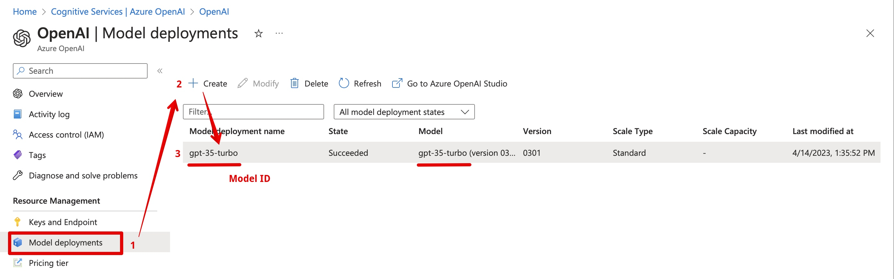
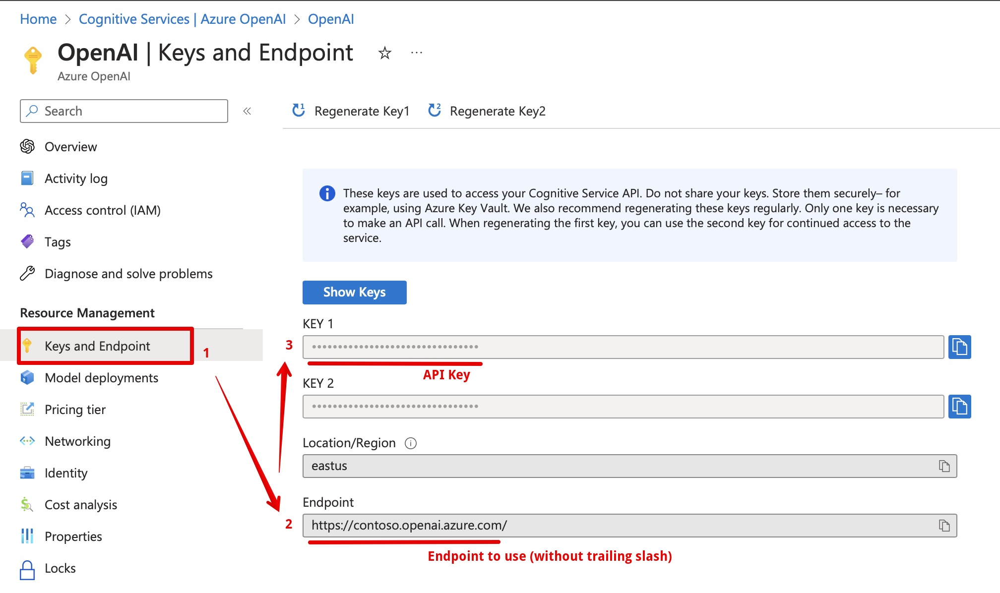

# Azure OpenAI / ChatGPT sample



This sample demonstrates how to use the Azure OpenAI service within a custom application in Node.js with a possibility of extending AI model knowledge context.

## Prerequisites

- Azure subscription
- Azure OpenAI Cognitive Service
- Node.js

## Setup

1. Clone the repository

   ```bash
   git clone https://github.com/koltyakov/azure-openai-sample.git
   ```

2. Install dependencies

   ```bash
   npm install
   ```

3. Copy `.env.sample` to `.env` and fill in the required values

   - OPENAI_URL=https://{instance}.openai.azure.com # Azure OpenAI endpoint, where {instance} is the name of your Azure OpenAI service instance, e.g. "contoso"
   - OPENAI_KEY=5f121687ba674163997c4c6cb781a1a2 # Azure OpenAI API Key
   - OPENAI_MODEL=gpt-35-turbo # Azure OpenAI Model ID

   See more in [Azure Configuration](#azure-configuration) section.

4. Run the sample

   ```bash
   npm start
   ```

5. Navigate to `http://localhost:3000` in your browser

## Azure Configuration

1. Create an Azure OpenAI Cognitive Service

2. Deploy ChatGPT model

   

3. Get the endpoint and key

   

## Code structure

> See self descriptive comments in code

- [/src](./src/)
  - [chat.ts](./src/chat.ts) - AI chat class with OpenAI adapted for Azure <- here is the most interesting part
  - [config.ts](./src/config.ts) - configuration reader
  - [facts.ts](./src/facts.ts) - sample of facts to extend AI model knowledge context
  - [server.ts](./src/server.ts) - sample server with Fastify (can be anything you like)
- [/public](./public/)
  - [index.html](./public/index.html) - bare minimum HTML page with chat form
- [/kb](./kb/) - knowledge base folder

## Highlights

### Knowledge base

ChatGPT has a limited knowledge of world and events after 2021. Also it doesn't know any specifics about your business domain. However, you can extend its knowledge by providing additional facts to the model.

This can be done within the dialog itself. E.g. "My name is Andrew", then "What's my name?" and the model will answer "Andrew". Yet, a user asking a question not necessarily knows facts, otherwise the question wouldn't be asked at all.

The approach to enrich the model with custom facts is pretty simple. You should treat raw or transformed qustion from a user and before sending it to the AI API query your corporate knowledge base, extract and reduce data context and provide it back AI together with the user question.

It could be common requesting your enterprise search engine, SharePoint for example, or a vector database, etc. for getting the facts. In a contrast to the ordinary search UI, AI will adapt output in a human friendly way.

### Messages history

Azure OpenAI / ChatGPT is stateless, it doesn't remember anything from question to question. But how the next answer seems to know the previous dialog? It's done with a sort of a hack, each next request technically contains the previous questions and answers. Sample shows how to manage this and control the history length.

### Price warning

Azure OpenAI / ChatGPT is a paid service. The price depends on the model and the number of tokens.

Token is a unit of measure for the number of characters in the input text. A token is in general a 4 char english word. But keep in mind, it's not how many caracters in a next user question. Nope, you send much more: the facts context and history of the dialog. A request tokens can't exceed a threshold. For ChatGPT 3.5-turbo model it's 4000 tokens.

The custom app should be aware of this, keep under control the history length and the number of facts to enrich the model knowledge context to reduce price.

### Corporate data exposure?

While working with Azure OpenAI / ChatGPT model the user requests do not treated for model training. Enriched context exists within the session managed by your application.

### AI can lie!

AI "lies" or hallucinates, it can invent a random not existing or truethful information. Always keep in mind this. Never make a decision based on AI output only.

## References

- [Intro to Azure OpenAI & ChatGPT (gpt-35-turbo)](https://www.youtube.com/watch?v=jskenvwlnAI)
- [Can ChatGPT work with your enterprise data?](https://www.youtube.com/watch?v=tW2EA4aZ_YQ)

## License

MIT
